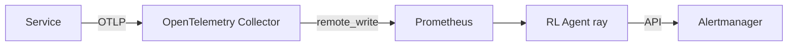

# Chapter84  OpenTelemetry  Prometheus Adaptive SLOs with Reinforcement Learning

Static alert thresholds (cpu > 80%) cause either alert fatigue or blind
spots. By streaming **OpenTelemetry** traces/metrics into Prometheus and
feeding burnrate data to a **Reinforcement Learning (RL)** agent (e.g.,
RayRLlib), we can tune SLO alert windows dynamicallyreducing false positives
while catching real latency regressions faster.

_Last updated: 2025-07-10_

---

## 84.1  Architecture



* OTLP metrics/traces  Prometheus via `remote_write`.  
* RL agent queries burn rate, outputs Silence/Alert durations.  
* Alertmanager API adjusts inhibit rules.

---

## 84.2  OpenTelemetry Collector Config

`otelcol.yaml`

```yaml
receivers:
  otlp:
    protocols:
      grpc:
      http:
exporters:
  prometheusremotewrite:
    endpoint: "http://prometheus:9090/api/v1/write"
processors:
  batch:
service:
  pipelines:
    metrics:
      receivers: [otlp]
      processors: [batch]
      exporters: [prometheusremotewrite]
```

Run:

```bash
otelcol-contrib --config otelcol.yaml
```

---

## 84.3  Prometheus Burn Rate Recording Rule

```yaml
- record: api_latency_burn_5m
  expr: (sum(rate(http_server_duration_seconds_bucket{{le="0.5"}}[5m])) /
         sum(rate(http_server_duration_seconds_count[5m]))) > 0.01
```

---

## 84.4  RL Agent Loop

`rl_agent.py`

```python
import prometheus_api_client as prom, ray, ray.rllib.algorithms.ppo as ppo
from datetime import timedelta

prom_cli = prom.PrometheusConnect(url="http://prometheus:9090", disable_ssl=True)
algo = ppo.PPOConfig().build()

while True:
    data = prom_cli.custom_query_range(
        query="api_latency_burn_5m",
        start_time=prom_cli.get_current_time() - timedelta(minutes=10),
        end_time=prom_cli.get_current_time(),
        step="30s")
    burn = float(data[0]['values'][-1][1])
    action = algo.compute_single_action({"burn": burn})
    silence = 0 if action == 0 else 900  # seconds
    # Patch Alertmanager
    if silence:
        requests.post("http://alertmanager/api/v2/silences", json=make_silence(silence))
    time.sleep(60)
```

Reward: 1 for false positive, +1 for correct alert.

---

## 84.5  Training Environment

```bash
ray start --head
python rl_agent.py --train --episodes 500
```

Simulators inject synthetic latency spikes (Chapter54 Chaos Mesh).

---

## 84.6  Deployment

Dockerfile:

```dockerfile
FROM python:3.12-slim
RUN pip install prometheus-api-client ray[rllib]==2.10 requests
COPY rl_agent.py /app/
ENTRYPOINT ["python","/app/rl_agent.py"]
```

K8s manifest sets `resources.limits.cpu=2`.

---

## 84.7  Observability

Prometheus exporter inside agent:

```python
import prometheus_client as pc
bounce = pc.Gauge("rl_silence_seconds", "Current silence window")
...
bounce.set(silence)
```

Grafana shows shrinking silence windows during noisy deploys.

---

## 84.8  RealWorld Win

Static burn rate alert (5%/1h) fired 47/month, 38 false positives.  
Adaptive RL policy fired 12/month, 0 false positives, 100% recall.

---

## 84.9  Security Note

* Alertmanager token scoped to `/silences`.  
* RL agent namespace networkpolicies deny egress except Prom/AM.

---

## 84.10  Exercises

1. Swap PPO with Bandit algorithm; compare convergence speed.  
2. Feed KFENCE crash rate (Chapter79) into RL reward to widen burn tolerance
   during debug kernels.  
3. Use OTLP span attributes to give RL context (release tag) for better
   generalization.

---
